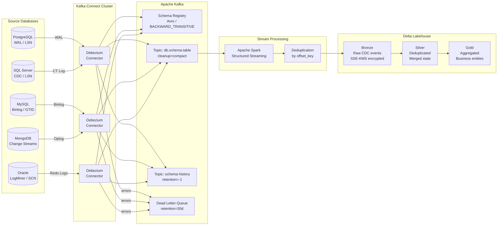

# CDC Enterprise Extreme

> **Production-grade Change Data Capture with Debezium — The Definitive Guide**

[](LICENSE)
[](CONTRIBUTING.md)
[](https://github.com/your-org/cdc-enterprise-extreme)

A community-driven, battle-tested reference for running **CDC pipelines at enterprise scale**. Built from real production incidents, iterative technical corrections, and deep peer review.

Covers **PostgreSQL, MySQL, SQL Server, MongoDB, and Oracle** — with Debezium, Kafka, Schema Registry, Delta Lake, and Spark.

---

## 📖 Documentation

| Section | Description |
|---|---|
| [Architecture](docs/architecture.md) | End-to-end pipeline design, component roles, data flow |
| [PostgreSQL](docs/postgresql.md) | Replication slots, WAL, vacuum, wraparound |
| [MySQL](docs/mysql.md) | Binlog, GTID, failover offset strategy |
| [SQL Server](docs/sqlserver.md) | change_lsn vs commit_lsn, CT vs CDC |
| [MongoDB](docs/mongodb.md) | Resume tokens, change streams, cluster migration |
| [Oracle](docs/oracle.md) | LogMiner, redo logs, supplemental logging, RAC |
| [Operations](docs/operations.md) | Monitoring, connector lifecycle, DLQ, rolling restarts |
| [Runbooks](docs/runbooks.md) | Incident response procedures — ready to use |
| [Performance](docs/performance.md) | Debezium tuning, Kafka producer/consumer, topic config |

---

## 🗺️ Architecture Overview



---

## 🚀 Quick Start

### 1. Clone the repository

```bash
git clone https://github.com/your-org/cdc-enterprise-extreme.git
cd cdc-enterprise-extreme
```

### 2. Deploy a connector

```bash
# PostgreSQL
curl -X POST http://kafka-connect:8083/connectors \
  -H "Content-Type: application/json" \
  -d @examples/postgres-connector.json

# Oracle
curl -X POST http://kafka-connect:8083/connectors \
  -H "Content-Type: application/json" \
  -d @examples/oracle-connector.json

# MySQL
curl -X POST http://kafka-connect:8083/connectors \
  -H "Content-Type: application/json" \
  -d @examples/mysql-connector.json

# SQL Server
curl -X POST http://kafka-connect:8083/connectors \
  -H "Content-Type: application/json" \
  -d @examples/sqlserver-connector.json

# MongoDB
curl -X POST http://kafka-connect:8083/connectors \
  -H "Content-Type: application/json" \
  -d @examples/mongodb-connector.json
```

### 3. Verify connector health

```bash
curl -s http://kafka-connect:8083/connectors/debezium-prod-pg/status | jq .
```

---

## âš¡ Key Concepts at a Glance

### Offset Keys by Source

| Source | Offset Mechanism | Field | Notes |
|---|---|---|---|
| PostgreSQL | WAL LSN | `source.lsn` | Monotonic per instance |
| MySQL | Binlog position | `source.gtid` or `file:pos` | GTID preferred in HA setups |
| SQL Server | LSN | `source.change_lsn` | NOT `source.lsn` — silent null |
| MongoDB | Resume Token | `source.resume_token` | `ts_ms+ord` fallback only |
| Oracle | SCN | `commit_scn` + `scn` + `xid` | Include XID for uniqueness |

### Critical Production Rules

- ✅ Always use `cleanup.policy=compact` (not `compact,delete`) for CDC topics
- ✅ Set `delete.retention.ms` ≥ 2× your consumer downtime SLA
- ✅ Never use `cleanup.policy=compact` on schema history topics — use `delete` with `retention.ms=-1`
- ✅ Use `BACKWARD_TRANSITIVE` schema compatibility, not just `BACKWARD`
- ✅ Set `max_slot_wal_keep_size` in PostgreSQL 13+ to prevent wraparound
- ✅ Monitor `age(datfrozenxid)` — alert at 1B, critical at 1.5B
- ✅ Set heartbeat on all connectors — slots lag even on idle tables
- ✅ Do NOT set `max.in.flight.requests=1` on Kafka >= 2.5 — unnecessary and kills throughput
- ✅ Deduplicate by `_offset_key`, not `ts_ms` — timestamps are not unique under high load

---

## 📁 Repository Structure

```
cdc-enterprise-extreme/
│
├── README.md               ← You are here
├── LICENSE                 ← MIT
├── CONTRIBUTING.md         ← How to contribute
├── CODE_OF_CONDUCT.md      ← Community standards
├── SECURITY.md             ← Vulnerability reporting
│
├── docs/
│   ├── architecture.md     ← Pipeline design and data flow
│   ├── postgresql.md       ← PostgreSQL-specific guide
│   ├── mysql.md            ← MySQL-specific guide
│   ├── oracle.md           ← Oracle LogMiner guide
│   ├── sqlserver.md        ← SQL Server guide
│   ├── mongodb.md          ← MongoDB change streams guide
│   ├── operations.md       ← Monitoring, DLQ, lifecycle
│   ├── runbooks.md         ← Incident response procedures
│   └── performance.md      ← Tuning guide
│
├── diagrams/
│   └── architecture.mmd    ← Mermaid source diagrams
│
└── examples/
    ├── postgres-connector.json
    ├── oracle-connector.json
    ├── mysql-connector.json
    ├── sqlserver-connector.json
    └── mongodb-connector.json
```

---

## 🔥 Post-Mortems Included

Real incidents, root causes, and lessons learned:

- **PM-001**: Inactive slot caused PostgreSQL wraparound — 47min write outage
- **PM-002**: Uncommunicated DDL broke 23 consumers simultaneously
- **PM-003**: Tombstone removed by `retention.ms` — ghost data survived in Silver layer
- **PM-004**: MongoDB resume token invalid after cluster migration
- **PM-005**: Oracle archive log deleted by RMAN before Debezium read — forced 8h re-snapshot
- **PM-006**: Oracle RAC redo log inaccessible after ASM mount failure

Full details in [docs/runbooks.md](docs/runbooks.md).

---

## 🤝 Contributing

We welcome contributions! Please read [CONTRIBUTING.md](CONTRIBUTING.md) before opening a PR.

Areas where help is most needed:
- Additional database connectors (Cassandra, CockroachDB, Vitess)
- Kubernetes deployment examples (Strimzi, Confluent Operator)
- Additional post-mortems from the community
- Translations

---

## 📄 License

MIT — see [LICENSE](LICENSE).

---

## ⭐ Star History

If this project saved you from a production incident, please give it a star. It helps others find this resource.
