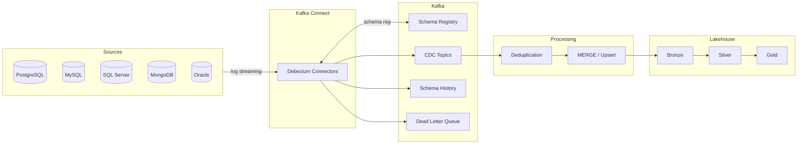
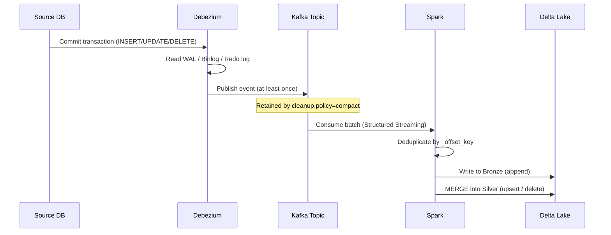
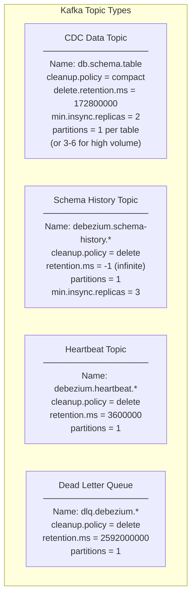
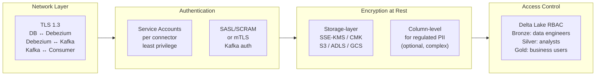

# Architecture

This document describes the end-to-end architecture of a production CDC pipeline using Debezium, Apache Kafka, and a Delta Lakehouse.

---

## Overview



---

## Component Roles

### Debezium (Kafka Connect Source)

Debezium reads the **transaction log** of each database and converts every change into a structured event published to Kafka. It does **not** poll tables — it tails the native change log.

| Database | Log mechanism | Offset type |
|---|---|---|
| PostgreSQL | WAL (Write-Ahead Log) | LSN |
| MySQL | Binary Log | GTID or file+pos |
| SQL Server | CT / CDC log | change_lsn |
| MongoDB | Oplog | Resume Token |
| Oracle | Redo + Archive Logs | SCN |

### Apache Kafka

Acts as the **durable, ordered, replayable buffer** between the source databases and downstream consumers. Key properties for CDC:

- Partitioned by primary key → preserves per-entity ordering
- Compacted topics → stores latest state per key indefinitely
- Schema Registry → enforces schema compatibility on every message

### Schema Registry

Stores Avro schemas and enforces **compatibility rules**. Every message written by Debezium registers its schema before publishing. Recommended mode: `BACKWARD_TRANSITIVE`.

### Delta Lakehouse

Three-layer Medallion Architecture:

- **Bronze**: raw, immutable CDC events exactly as received from Kafka. Provides a "technical replay" capability. Never modified. Encrypted at rest.
- **Silver**: deduplicated, current state per entity. Business logic applied (e.g., DELETEs). This is where **PII masking** typically occurs to balance compliance with analytical needs.
- **Gold**: aggregated business entities, SLA-driven freshness.

---

## Data Flow — Event Lifecycle



---

## Delivery Guarantees

| Leg | Guarantee | Notes |
|---|---|---|
| DB → Debezium | At-least-once | Restart may re-read events |
| Debezium → Kafka | At-least-once | Idempotent producer reduces duplicates |
| Kafka → Consumer | At-least-once | Exactly-once requires Kafka 3.3+ and transactional consumers |
| Consumer → Delta Lake | Exactly-once (with MERGE) | MERGE is idempotent by PK |

> [!IMPORTANT]
> **Exactly-once source is NOT exactly-once end-to-end.**
> Even with `exactly.once.source.support=enabled`, manual offset resets or non-transactional consumers can still cause duplicates.

### Deduplication Strategy

Deduplication must be handled in two distinct phases:

1.  **Technical Deduplication (Bronze)**: Removes exact duplicates of the same event (same `_offset_key`).
2.  **Logical Deduplication (Silver)**: Ensures the latest state per Primary Key (PK) by using the highest monotonic offset.

```python
def deduplicate_latest_by_pk(df, pk_cols, offset_col='_offset_key'):
    # Logical deduplication: PK + highest offset
    window = (
        Window
        .partitionBy(*pk_cols)
        .orderBy(F.col(offset_col).cast('long').desc())
    )

    return (
        df
        .withColumn('_rank', F.row_number().over(window))
        .filter(F.col('_rank') == 1)
        .drop('_rank')
    )
```

---

## Topic Design



> [!WARNING]
> **Tombstone Requirement**: For `cleanup.policy=compact` to work correctly, the Kafka message **key** must be exactly the Primary Key of the source table. Altering the key via SMTs or incorrect converters will prevent the removal of deleted records.

> [!CAUTION]
> **Never** use `cleanup.policy=compact` on the schema history topic. It must preserve every DDL event in order — compaction would remove intermediate states needed for schema reconstruction.

---

## Security Architecture



---

## Observability

Every production CDC pipeline must monitor three distinct layers:

**1. Database layer**
- Replication slot lag (PostgreSQL)
- Archive log availability (Oracle)
- Binlog retention (MySQL)

**2. Kafka Connect layer**
- Connector / task state via REST API
- `MilliSecondsBehindSource` JMX metric
- Dead Letter Queue message rate

**3. Kafka / Topic layer**
- Consumer group lag (`records-lag-max`)
- Topic partition count vs throughput
- Schema Registry error rate

### Incremental Snapshot Risks

Use when you need to re-capture a table without restarting the connector. 

> [!CAUTION]
> **Mutable Primary Keys**: If a Primary Key is altered during an incremental snapshot, the record may appear in two different chunks, leading to logical duplicates in the target. Ensure PKs are immutable or handle this risk in the Silver layer.
