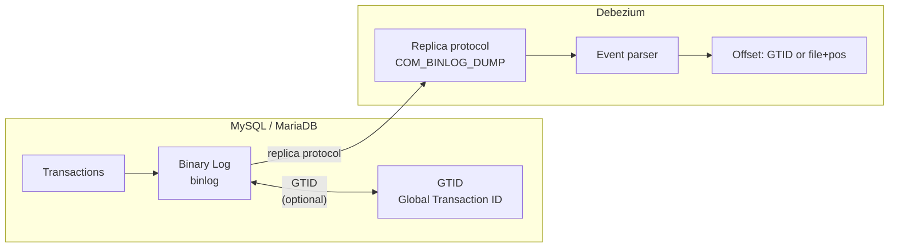

# MySQL — Binlog, GTID & Failover

---

## How It Works



Debezium connects as a MySQL replica using the native replication protocol. It receives binlog events in real time and converts them into Debezium change events.

---

## Prerequisites

```sql
-- my.cnf / my.ini
[mysqld]
server-id         = 1           -- unique across all servers
log_bin           = mysql-bin
binlog_format     = ROW         -- required (not STATEMENT or MIXED)
binlog_row_image  = FULL        -- required for before state on UPDATE
expire_logs_days  = 7           -- keep logs at least 2× connector downtime SLA

-- GTID (recommended for HA)
gtid_mode                = ON
enforce_gtid_consistency = ON

-- Create Debezium user
CREATE USER 'debezium'@'%' IDENTIFIED BY 'SecurePassword123!';
GRANT SELECT, RELOAD, SHOW DATABASES, REPLICATION SLAVE, REPLICATION CLIENT ON *.* TO 'debezium'@'%';
FLUSH PRIVILEGES;
```

---

## Connector Configuration

```json
{
  "name": "debezium-mysql-prod",
  "config": {
    "connector.class": "io.debezium.connector.mysql.MySqlConnector",
    "database.hostname": "mysql-prod.empresa.com",
    "database.port": "3306",
    "database.user": "debezium",
    "database.password": "${file:/opt/connect/secrets.properties:mysql.password}",
    "database.server.id": "184054",
    "topic.prefix": "prod-mysql",
    "database.include.list": "mydb",
    "table.include.list": "mydb.orders,mydb.customers",
    "snapshot.mode": "initial",
    "heartbeat.interval.ms": "10000",
    "schema.history.internal.kafka.bootstrap.servers": "kafka:9092",
    "schema.history.internal.kafka.topic": "debezium.schema-history.prod-mysql",
    "decimal.handling.mode": "precise",
    "time.precision.mode": "adaptive_time_microseconds",
    "include.schema.changes": "true"
  }
}
```

---

## Offset Strategy — GTID vs file+pos

### Standard: file + position

Works correctly in single-server setups:

```python
file_pos = F.concat(F.col('source.file'), F.lit(':'), F.col('source.pos').cast('string'))
```

### Enterprise: GTID with fallback

In HA setups with automatic failover, the same `file` and `pos` values can exist on different server instances after failover — causing offset key collisions.

```python
if source_type == 'mysql':
    gtid    = F.col('source.gtid')
    file_pos = F.concat(
        F.col('source.file'),
        F.lit(':'),
        F.col('source.pos').cast('string')
    )
    # coalesce: uses GTID when available, falls back to file:pos
    return df.withColumn('_offset_key', F.coalesce(gtid, file_pos))
```

> [!WARNING]
> **GTID Multi-source Pitfalls**: In multi-source replication environments, `source.gtid` may contain multiple UUID ranges concatenated. Lexicographical sorting of these strings **does not guarantee global monotonic ordering**.
>
> **Recommended Enterprise Ordering Strategy**:
> Use `source.ts_ms` (timestamp) combined with the offset key as a fallback for stable ordering in Silver layer MERGE operations.

---

## Monitoring

```sql
-- Binlog status and current position
SHOW MASTER STATUS;

-- Available binary logs
SHOW BINARY LOGS;

-- Replication client sessions (Debezium will appear here)
SHOW PROCESSLIST;

-- GTID status
SHOW VARIABLES LIKE 'gtid_mode';
SHOW VARIABLES LIKE 'gtid_executed';
```
