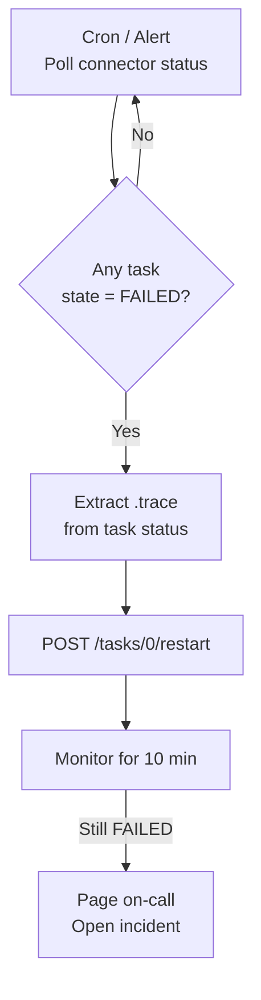
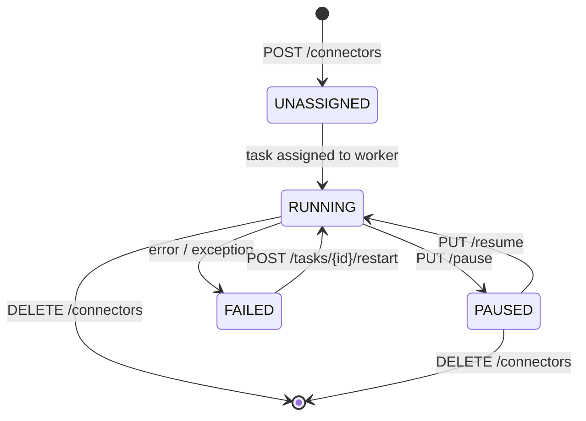
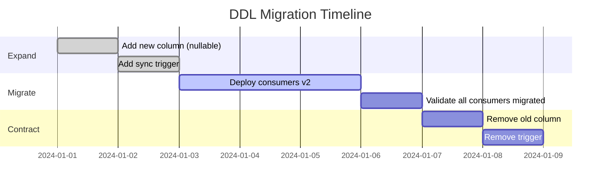

# Operations — Monitoring, Lifecycle & DLQ

---

## Connector Status via REST API

```bash
# List all connectors with their status
curl -s http://kafka-connect:8083/connectors?expand=status | jq '
  to_entries[] | {
    name:  .key,
    state: .value.status.connector.state,
    tasks: [.value.status.tasks[] | {id: .id, state: .state}]
  }
'

# Single connector status
curl -s http://kafka-connect:8083/connectors/debezium-prod-pg/status | jq .

# Get stored offsets
curl -s http://kafka-connect:8083/connectors/debezium-prod-pg/offsets | jq .
```

---

## Task Failure Detection



```bash
#!/bin/bash
# task-health-check.sh — run via cron every 2 minutes
CONNECT_URL="http://kafka-connect:8083"

for connector in $(curl -s $CONNECT_URL/connectors | jq -r '.[]'); do
    status=$(curl -s "$CONNECT_URL/connectors/$connector/status")
    failed_tasks=$(echo $status | jq -r '.tasks[] | select(.state == "FAILED") | .id')

    if [ -n "$failed_tasks" ]; then
        echo "[$(date)] ALERT: Task FAILED in connector $connector — tasks: $failed_tasks"
        echo $status | jq '.tasks[] | select(.state == "FAILED") | .trace' >&2

        # Auto-restart (with caution — log the attempt)
        curl -s -X POST "$CONNECT_URL/connectors/$connector/tasks/0/restart"
        echo "[$(date)] Restart triggered for $connector"
    fi
done
```

---

## Dead Letter Queue

Configure DLQ to prevent deserialization errors from stalling the connector:

```json
{
  "errors.tolerance": "all",
  "errors.deadletterqueue.topic.name": "dlq.debezium.prod-pg",
  "errors.deadletterqueue.topic.replication.factor": "3",
  "errors.deadletterqueue.context.headers.enable": "true",
  "errors.log.enable": "true",
  "errors.log.include.messages": "true"
}
```

> ⚠️ With `errors.tolerance=all`, the connector **continues processing** even when events fail. Monitor the DLQ actively — messages there indicate data loss or corruption.

```bash
# Monitor DLQ message rate
kafka-consumer-groups.sh --bootstrap-server kafka:9092 \
  --group dlq-monitor \
  --describe \
  --topic dlq.debezium.prod-pg

# Read DLQ messages (last 100)
kafka-console-consumer.sh --bootstrap-server kafka:9092 \
  --topic dlq.debezium.prod-pg \
  --from-beginning \
  --max-messages 100 \
  --property print.headers=true
```

---

## Rolling Restart

```bash
# 1. Pause (stops consuming from DB, offsets preserved)
curl -X PUT http://kafka-connect:8083/connectors/debezium-prod-pg/pause

# 2. Wait for in-flight events to drain
sleep 15

# 3. Rolling restart of Connect workers (one at a time in cluster)
#    Kafka Connect rebalances tasks automatically
systemctl restart kafka-connect   # on each worker node, sequentially

# 4. Verify status after each worker restart
curl -s http://kafka-connect:8083/connectors/debezium-prod-pg/status | jq .

# 5. Resume
curl -X PUT http://kafka-connect:8083/connectors/debezium-prod-pg/resume
```

---

## Connector Lifecycle



---

## Schema History Topic

```bash
# Create before deploying any connector (do this once per environment)
kafka-topics.sh --create \
  --bootstrap-server kafka:9092 \
  --topic debezium.schema-history.prod-pg \
  --partitions 1 \
  --replication-factor 3 \
  --config cleanup.policy=delete \
  --config retention.ms=-1 \
  --config min.insync.replicas=2

# NEVER use cleanup.policy=compact on history topics
# The full ordered history of DDL events must be preserved
```

If the schema history topic is lost, recover with:
```properties
snapshot.mode=schema_only_recovery
```

---

## DDL Strategy — Expand → Migrate → Contract

Safe pattern for renaming or removing columns without breaking consumers:



```sql
-- EXPAND: add new column, keep old
ALTER TABLE orders ADD COLUMN customer_full_name VARCHAR(255);

-- SYNC: keep both in sync during migration
CREATE OR REPLACE FUNCTION sync_customer_name()
RETURNS TRIGGER AS $$
BEGIN
    IF NEW.customer_name IS NOT NULL THEN
        NEW.customer_full_name = NEW.customer_name;
    END IF;
    RETURN NEW;
END;
$$ LANGUAGE plpgsql;

CREATE TRIGGER sync_name BEFORE INSERT OR UPDATE ON orders
FOR EACH ROW EXECUTE FUNCTION sync_customer_name();

-- CONTRACT (after all consumers migrated): drop old column
DROP TRIGGER sync_name ON orders;
ALTER TABLE orders DROP COLUMN customer_name;
```

---

## JMX Metrics to Monitor

| Metric | Bean | Alert threshold |
|---|---|---|
| `MilliSecondsBehindSource` | `debezium.postgres:type=connector-metrics,context=streaming` | > 30,000 ms |
| `SnapshotRunning` | `debezium.postgres:type=connector-metrics,context=snapshot` | Monitor duration |
| `records-lag-max` | `kafka.consumer:type=consumer-fetch-manager-metrics` | > 10,000 |
| `NumberOfDisconnects` | `debezium.postgres:type=connector-metrics` | > 0 in 5 min |

---

## Topic Configuration Reference

| Topic Type | cleanup.policy | retention.ms | delete.retention.ms | partitions | min.insync.replicas |
|---|---|---|---|---|---|
| CDC data (normal) | `compact` | `-1` | `172800000` (48h) | 1–3 | 2 |
| CDC data (high volume) | `compact,delete` | `604800000` (7d) | `172800000` (48h) | 3–6 | 2 |
| Schema history | `delete` | `-1` | — | 1 | 3 |
| DLQ | `delete` | `2592000000` (30d) | — | 1 | 2 |
| Heartbeat | `delete` | `3600000` (1h) | — | 1 | 1 |
