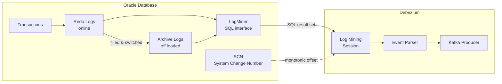

# Oracle — LogMiner, Redo Logs & SCN

Oracle CDC via Debezium is the most complex source connector. It uses Oracle's native **LogMiner** utility to read Redo and Archive Logs, extracting change events without impacting transactional workloads.

---

## How It Works



### Mining Strategies

| Strategy | Dictionary source | Best for |
|---|---|---|
| `online_catalog` | Live database dictionary | Low DDL frequency |
| `redo_log_catalog` | Dictionary embedded in redo log | **Recommended** — DDL-heavy environments |

---

## Prerequisites

### 1. Enable Archive Log Mode

> ⚠️ **Requires database restart.** Plan a maintenance window.

```sql
SHUTDOWN IMMEDIATE;
STARTUP MOUNT;
ALTER DATABASE ARCHIVELOG;
ALTER DATABASE OPEN;

-- Verify
SELECT log_mode FROM v$database;
-- Expected: ARCHIVELOG
```

### 2. Enable Supplemental Logging

```sql
-- Minimum required
ALTER DATABASE ADD SUPPLEMENTAL LOG DATA;

-- Recommended: capture full BEFORE state on UPDATEs
ALTER DATABASE ADD SUPPLEMENTAL LOG DATA (ALL) COLUMNS;

-- Or per table (less overhead)
ALTER TABLE schema_app.orders ADD SUPPLEMENTAL LOG DATA (ALL) COLUMNS;

-- Verify
SELECT supplemental_log_data_min, supplemental_log_data_all FROM v$database;
-- Expected: YES, YES
```

> ⚠️ Without `ALL COLUMNS` supplemental logging, the `before` field in UPDATE events will be `null`. This breaks MERGE-based Silver layer pipelines.

### 3. Create Debezium User

```sql
-- Oracle 12c+ (CDB — Container Database)
CREATE USER c##debezium IDENTIFIED BY "SecurePassword123!";
ALTER USER c##debezium SET CONTAINER_DATA = ALL CONTAINER = CURRENT;

GRANT CREATE SESSION        TO c##debezium CONTAINER = ALL;
GRANT SET CONTAINER         TO c##debezium CONTAINER = ALL;
GRANT SELECT ON V_$DATABASE TO c##debezium CONTAINER = ALL;
GRANT FLASHBACK ANY TABLE   TO c##debezium CONTAINER = ALL;
GRANT SELECT ANY TABLE      TO c##debezium CONTAINER = ALL;
GRANT SELECT_CATALOG_ROLE   TO c##debezium CONTAINER = ALL;
GRANT EXECUTE_CATALOG_ROLE  TO c##debezium CONTAINER = ALL;
GRANT SELECT ANY TRANSACTION TO c##debezium CONTAINER = ALL;
GRANT LOGMINING             TO c##debezium CONTAINER = ALL;

-- Oracle 11g (non-CDB)
CREATE USER debezium IDENTIFIED BY "SecurePassword123!";
GRANT CREATE SESSION, SELECT ANY TABLE, LOGMINING,
      SELECT_CATALOG_ROLE, EXECUTE_CATALOG_ROLE,
      SELECT ANY TRANSACTION, FLASHBACK ANY TABLE TO debezium;
```

---

## Connector Configuration

```json
{
  "name": "debezium-oracle-prod",
  "config": {
    "connector.class": "io.debezium.connector.oracle.OracleConnector",

    "database.hostname": "oracle-prod.empresa.com",
    "database.port": "1521",
    "database.user": "c##debezium",
    "database.password": "${file:/opt/connect/secrets.properties:oracle.password}",
    "database.dbname": "ORCLCDB",
    "database.pdb.name": "ORCLPDB1",

    "topic.prefix": "prod-oracle",
    "schema.include.list": "SCHEMA_APP",
    "table.include.list": "SCHEMA_APP.ORDERS,SCHEMA_APP.CUSTOMERS",

    "log.mining.strategy": "redo_log_catalog",
    "log.mining.continuous.mine": "true",
    "log.mining.batch.size.default": "1000",
    "log.mining.batch.size.max": "10000",
    "log.mining.sleep.time.default.ms": "1000",
    "log.mining.sleep.time.min.ms": "300",
    "log.mining.sleep.time.max.ms": "3000",

    "schema.history.internal.kafka.bootstrap.servers": "kafka:9092",
    "schema.history.internal.kafka.topic": "debezium.schema-history.prod-oracle",

    "snapshot.mode": "initial",
    "snapshot.locking.mode": "minimal",

    "decimal.handling.mode": "precise",
    "time.precision.mode": "adaptive_time_microseconds",
    "lob.enabled": "false",

    "heartbeat.interval.ms": "10000",
    "heartbeat.action.query": "UPDATE SCHEMA_APP.DEBEZIUM_HEARTBEAT SET TS = SYSTIMESTAMP WHERE ID = 1"
  }
}
```

---

## SCN — System Change Number

The SCN is Oracle's equivalent of PostgreSQL's LSN. It is a global, monotonically increasing number that identifies every consistency point in the database.

```sql
-- Current SCN
SELECT current_scn FROM v$database;

-- Convert SCN to timestamp
SELECT scn_to_timestamp(current_scn) FROM v$database;

-- Available archive logs and their SCN range
SELECT sequence#, first_change#, next_change#, first_time, deleted
FROM v$archived_log
WHERE standby_dest = 'NO'
ORDER BY sequence# DESC
FETCH FIRST 20 ROWS ONLY;
```

### Debezium Event Payload — Oracle

```json
{
  "before": { "id": 1, "nome": "Alice", "valor": 99.90 },
  "after":  { "id": 1, "nome": "Alicia", "valor": 99.90 },
  "source": {
    "connector": "oracle",
    "name": "prod-oracle",
    "ts_ms": 1700000000000,
    "scn": "12345678",
    "commit_scn": "12345700",
    "schema": "SCHEMA_APP",
    "table": "ORDERS"
  },
  "op": "u"
}
```

### Offset Key for Oracle

```python
elif source_type == 'oracle':
    # commit_scn + xid + scn ensures uniqueness.
    # SCN alone is shared by all changes in the same transaction.
    return df.withColumn(
        '_offset_key',
        F.concat(
            F.col('source.commit_scn').cast('string'),
            F.lit('_'),
            F.coalesce(F.col('source.xid').cast('string'), F.lit('N/A')),
            F.lit('_'),
            F.col('source.scn').cast('string')
        )
    )
```

> [!IMPORTANT]
> **SCN Uniqueness**: SCN is monotonic globally, but multiple changes within the same transaction share the same `commit_scn`. In enterprise environments, always include `source.xid` (Transaction ID) and `source.scn` to guarantee unique event identification.

---

## Production Issues & Solutions

### Issue 1: ORA-01291 — Missing Logfile

**Cause**: RMAN deleted archive logs before Debezium read them.

```bash
# Check RMAN retention policy
rman target / <<EOF
SHOW ARCHIVELOG RETENTION POLICY;
EOF

# Configure minimum retention (7 days recommended)
rman target / <<EOF
CONFIGURE ARCHIVELOG RETENTION POLICY TO RECOVERY WINDOW OF 7 DAYS;
EOF
```

> ⚠️ Coordinate with DBAs: Debezium needs archive logs for at least 2× the maximum expected connector downtime. In enterprise setups, 7 days is the recommended minimum.

### Issue 2: LogMiner Performance Impact

LogMiner runs SQL queries against the database itself, consuming CPU and I/O on the primary node.

**Best practice**: use an **Active Data Guard (ADG) standby** as the mining source:

```json
{
  "database.hostname": "oracle-adg-standby.empresa.com"
}
```

This completely eliminates mining overhead on the primary — the gold standard for enterprise Oracle CDC.

### Issue 3: UPDATE with null `before`

```json
{
  "before": null,    ← supplemental logging not configured
  "after": { "id": 1, "nome": "Alicia" },
  "op": "u"
}
```

**Fix**:
```sql
ALTER TABLE schema_app.orders ADD SUPPLEMENTAL LOG DATA (ALL) COLUMNS;
```

Verify which tables are missing it:
```sql
SELECT owner, table_name, log_group_name, log_group_type
FROM dba_log_groups
WHERE owner = 'SCHEMA_APP';
```

### Issue 4: Problematic Data Types

| Oracle Type | Debezium Behavior | Recommendation |
|---|---|---|
| `NUMBER` (no precision) | Mapped as FLOAT64 — precision loss | Define precision on column or use `decimal.handling.mode=precise` |
| `DATE` | Includes time (Oracle-specific) — mapped as TIMESTAMP | Treat as TIMESTAMP in consumers |
| `CLOB` / `BLOB` | Captured by default, produces huge events | Disable: `lob.enabled=false` |
| `XMLTYPE` | Not natively supported | Exclude: `column.exclude.list=SCHEMA.TABLE.XML_COL` |
| `ROWID` | Physical row identifier — changes on row movement | Never use as a business key |

### Issue 5: Oracle RAC

In RAC environments, redo logs from all nodes must be accessible:

```json
{
  "database.url": "jdbc:oracle:thin:@(DESCRIPTION=(ADDRESS_LIST=(ADDRESS=(PROTOCOL=TCP)(HOST=rac1)(PORT=1521))(ADDRESS=(PROTOCOL=TCP)(HOST=rac2)(PORT=1521)))(CONNECT_DATA=(SERVICE_NAME=ORCLSVC)))"
}
```

> ⚠️ All nodes' redo logs must be accessible via shared storage (ASM or shared NFS). Verify ASM mount status on all nodes before and after maintenance.

---

## Monitoring

```sql
-- Active LogMiner sessions
SELECT sid, serial#, username, status, program
FROM v$session
WHERE username = 'C##DEBEZIUM' OR program LIKE '%LOGMNR%';

-- Archive logs: available vs gap risk
SELECT
    COUNT(*)                                     AS total,
    MIN(first_time)                              AS oldest,
    MAX(next_time)                               AS newest,
    SUM(blocks * block_size / 1024 / 1024)       AS total_mb
FROM v$archived_log
WHERE standby_dest = 'NO' AND deleted = 'NO';

-- Inactive sessions holding resources
SELECT blocking_session, sid, seconds_in_wait, event
FROM v$session
WHERE blocking_session IS NOT NULL
ORDER BY seconds_in_wait DESC;
```
