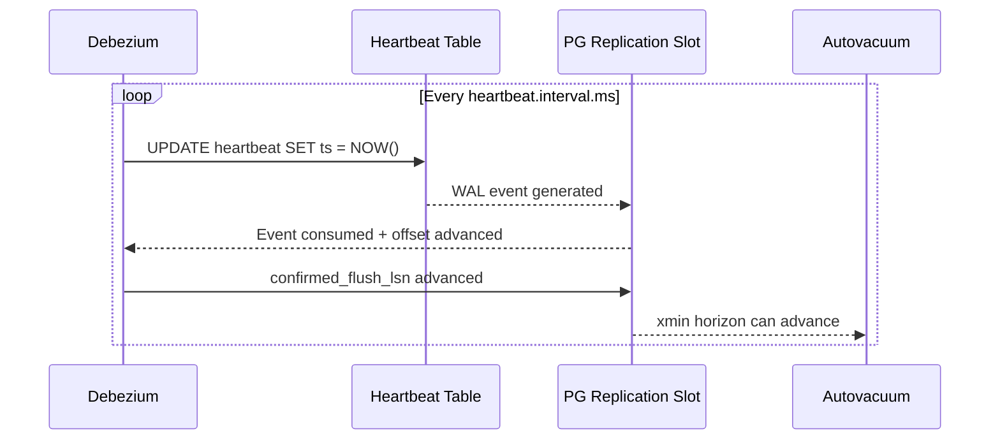
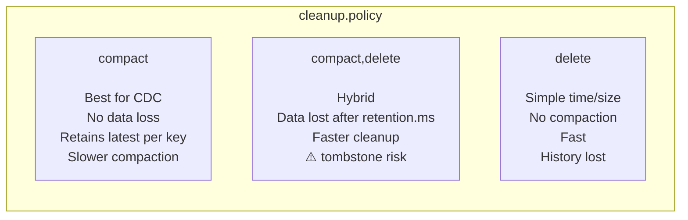
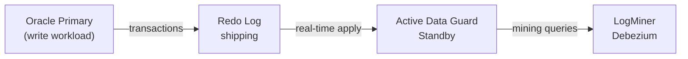

# Performance Tuning — Debezium & Kafka

---

## Debezium Connector Parameters

### Queue & Batch Sizing

```properties
# Events buffered in memory before publishing to Kafka
max.queue.size=8192
max.batch.size=2048

# Memory ceiling for the internal queue (Debezium 1.9+)
# Prevents OOM on large events (LOB columns, wide rows)
max.queue.size.in.bytes=67108864   # 64MB

# How often Debezium polls the DB log (lower = more CPU, less latency)
poll.interval.ms=500
```

### Snapshot Performance

```properties
# Rows fetched per DB round-trip during initial snapshot
# Increase for large tables; decrease if hitting memory limits
snapshot.fetch.size=10240

# Incremental snapshot chunk size (rows per chunk)
incremental.snapshot.chunk.size=1024

# Allow DDL changes during incremental snapshot (Debezium 2.3+)
incremental.snapshot.allow.schema.changes=true
```

### Heartbeat — Non-Negotiable



```properties
# Required on all connectors — especially low-traffic tables
heartbeat.interval.ms=10000

# PostgreSQL
heartbeat.action.query=UPDATE public.debezium_heartbeat SET ts = NOW() WHERE id = 1

# Oracle
heartbeat.action.query=UPDATE schema_app.debezium_heartbeat SET ts = SYSTIMESTAMP WHERE id = 1

# MySQL
heartbeat.action.query=UPDATE mydb.debezium_heartbeat SET ts = NOW() WHERE id = 1
```

Without heartbeat, the replication slot/binlog position only advances when real table events occur. On idle tables, this means vacuum is blocked indefinitely.

---

## Kafka Producer Parameters

### High Throughput (batch-oriented pipelines)

```properties
producer.linger.ms=100              # wait 100ms to batch messages
producer.batch.size=65536           # 64KB batch size
producer.compression.type=lz4       # fast compression, ~3x size reduction
producer.buffer.memory=134217728    # 128MB producer buffer
producer.enable.idempotence=true
producer.acks=all
```

### Low Latency (real-time alerting pipelines)

```properties
producer.linger.ms=0                # send immediately
producer.batch.size=16384           # 16KB
producer.compression.type=none      # no compression overhead
producer.enable.idempotence=true
producer.acks=all
```

### Idempotence — What's Actually Required (Kafka >= 2.5)

```properties
# Required
producer.enable.idempotence=true
producer.acks=all
producer.retries=2147483647

# NOT NEEDED in Kafka >= 2.5 with idempotence enabled
# Setting this to 1 kills throughput unnecessarily
# producer.max.in.flight.requests.per.connection=1   ← REMOVE THIS
```

> ⚠️ `max.in.flight.requests=1` was only needed for Kafka < 1.1. With idempotence enabled in modern Kafka, up to 5 in-flight requests per connection are allowed with full ordering guarantees.

---

## Kafka Consumer Parameters

```properties
# Throughput-optimized consumer (Spark Structured Streaming)
fetch.min.bytes=65536               # wait for at least 64KB before returning
fetch.max.wait.ms=500               # max wait time for fetch.min.bytes
max.poll.records=500                # max records per poll
max.partition.fetch.bytes=1048576   # 1MB per partition per fetch

# Session management — tune for rebalance sensitivity
session.timeout.ms=45000
heartbeat.interval.ms=15000
max.poll.interval.ms=300000         # must be > processing time per batch
```

---

## Topic Configuration Impact on Performance



```bash
# High-throughput table: more partitions, hybrid policy
kafka-topics.sh --create \
  --bootstrap-server kafka:9092 \
  --topic prod-pg.public.events \
  --partitions 6 \
  --replication-factor 3 \
  --config cleanup.policy=compact,delete \
  --config retention.ms=604800000 \
  --config delete.retention.ms=172800000 \
  --config segment.ms=3600000 \
  --config min.cleanable.dirty.ratio=0.1 \
  --config compression.type=lz4

# Low-volume reference table: compact only, retain forever
kafka-topics.sh --create \
  --bootstrap-server kafka:9092 \
  --topic prod-pg.public.products \
  --partitions 1 \
  --replication-factor 3 \
  --config cleanup.policy=compact \
  --config delete.retention.ms=172800000 \
  --config min.cleanable.dirty.ratio=0.1
```

---

## Oracle-Specific: LogMiner Performance

LogMiner is the heaviest CDC mechanism in terms of database resource consumption. Key levers:

```properties
# Batch size controls how many redo log entries are processed per mining session
log.mining.batch.size.default=1000
log.mining.batch.size.max=10000

# Sleep between mining sessions — tune to balance latency vs CPU
log.mining.sleep.time.default.ms=1000
log.mining.sleep.time.min.ms=300
log.mining.sleep.time.max.ms=3000
```

### Use ADG Standby as Mining Source



Point Debezium at the ADG standby instead of the primary. This is the **gold standard** for Oracle CDC in enterprise environments — zero mining overhead on the primary.

```json
{
  "database.hostname": "oracle-adg-standby.empresa.com"
}
```

---

## Deduplication Performance — Delta Lake

```python
from pyspark.sql import functions as F
from pyspark.sql.window import Window

def deduplicate(df, offset_col='_offset_key'):
    """
    Correct: partition by offset_key, order by offset_key (monotonic).
    Wrong: partition by offset_key, order by ts_ms (not guaranteed unique).
    """
    window = Window.partitionBy(offset_col).orderBy(F.col(offset_col).desc())
    return (
        df
        .withColumn('_rank', F.row_number().over(window))
        .filter(F.col('_rank') == 1)
        .drop('_rank')
    )

# For large streams: use dropDuplicates as first-pass (faster, less precise)
# followed by MERGE for final exactly-once semantics
df_dedup = df.dropDuplicates(['_offset_key'])   # approximate, fast
```

### MERGE into Silver — Idempotent Upsert

```python
from delta.tables import DeltaTable

def merge_to_silver(micro_batch_df, epoch_id):
    silver = DeltaTable.forName(spark, "silver.orders")

    silver.alias("target").merge(
        micro_batch_df.alias("source"),
        "target.id = source.id"
    ).whenMatchedDelete(
        condition="source.op = 'd'"
    ).whenMatchedUpdateAll(
        condition="source.op in ('u', 'r')"
    ).whenNotMatchedInsertAll(
        condition="source.op in ('c', 'r')"
    ).execute()
```
