# PostgreSQL — Replication Slots, WAL & Vacuum

PostgreSQL is the most feature-complete CDC source supported by Debezium. It is also the one with the most production pitfalls if vacuum and replication slots are not managed carefully.

---

## How It Works


Debezium uses the `pgoutput` logical decoding plugin (built-in since PostgreSQL 10) to consume WAL events from a **replication slot**. The slot retains WAL segments until Debezium confirms the offset via `confirmed_flush_lsn`.

---

## Prerequisites

```sql
-- postgresql.conf (requires restart)
wal_level = logical           -- required, default is replica
max_replication_slots = 10    -- at least 1 per connector + buffer
max_wal_senders = 10

-- Create dedicated user
CREATE USER debezium WITH REPLICATION LOGIN PASSWORD 'secure_password';
GRANT SELECT ON ALL TABLES IN SCHEMA public TO debezium;
ALTER DEFAULT PRIVILEGES IN SCHEMA public GRANT SELECT ON TABLES TO debezium;
```

---

## Connector Configuration

```json
{
  "name": "debezium-prod-pg",
  "config": {
    "connector.class": "io.debezium.connector.postgresql.PostgresConnector",
    "database.hostname": "pg-prod.empresa.com",
    "database.port": "5432",
    "database.user": "debezium",
    "database.password": "${file:/opt/connect/secrets.properties:pg.password}",
    "database.dbname": "mydb",
    "topic.prefix": "prod-pg",
    "plugin.name": "pgoutput",
    "slot.name": "debezium_prod",
    "publication.name": "debezium_pub",
    "table.include.list": "public.orders,public.customers",
    "snapshot.mode": "initial",
    "snapshot.locking.mode": "minimal",
    "heartbeat.interval.ms": "10000",
    "heartbeat.action.query": "UPDATE public.debezium_heartbeat SET ts = NOW() WHERE id = 1",
    "decimal.handling.mode": "precise",
    "time.precision.mode": "adaptive_time_microseconds",
    "tombstones.on.delete": "true",
    "signal.data.collection": "public.debezium_signals",
    "errors.tolerance": "all",
    "errors.deadletterqueue.topic.name": "dlq.debezium.prod-pg",
    "errors.deadletterqueue.topic.replication.factor": "3",
    "errors.deadletterqueue.context.headers.enable": "true",
    "errors.log.enable": "true",
    "errors.log.include.messages": "true",
    "key.converter": "io.confluent.connect.avro.AvroConverter",
    "value.converter": "io.confluent.connect.avro.AvroConverter",
    "key.converter.schema.registry.url": "http://schema-registry:8081",
    "value.converter.schema.registry.url": "http://schema-registry:8081"
  }
}
```

---

## LSN as Offset Key

The **LSN (Log Sequence Number)** is PostgreSQL's position in the WAL. It is monotonic and unique per instance — the correct identifier for deduplication.

```python
if source_type == 'postgresql':
    return df.withColumn('_offset_key', F.col('source.lsn').cast('string'))

# Logical deduplication: partition by PK, order by LSN descending
# Partitioning by _offset_key would be a no-op (each event has a unique offset)
window = Window.partitionBy(*pk_cols).orderBy(F.col('source.lsn').cast('long').desc())
```

---

## DDL Safety — RENAME COLUMN

> ⚠️ `RENAME COLUMN` does **not** invalidate the replication slot. WAL records structural changes correctly.

**What breaks:**
- Consumers referencing the old field name (silent failure)
- Schema Registry compatibility (requires new schema version)

**Safe DDL pattern:** Expand → Migrate → Contract (see [operations.md](operations.md)).

```sql
-- Step 1: Add new column alongside old one
ALTER TABLE orders ADD COLUMN customer_full_name VARCHAR(255);

-- Step 2: Keep them in sync during migration
CREATE OR REPLACE FUNCTION sync_customer_name()
RETURNS TRIGGER AS $$
BEGIN
    IF NEW.customer_name IS NOT NULL THEN
        NEW.customer_full_name = NEW.customer_name;
    END IF;
    RETURN NEW;
END;
$$ LANGUAGE plpgsql;

CREATE TRIGGER sync_name BEFORE INSERT OR UPDATE ON orders
FOR EACH ROW EXECUTE FUNCTION sync_customer_name();

-- Step 3: After all consumers migrated, drop the old column
DROP TRIGGER sync_name ON orders;
ALTER TABLE orders DROP COLUMN customer_name;
```

---

## Vacuum & Autovacuum — Critical Production Concern

This is the most dangerous operational aspect of PostgreSQL CDC. Failing to manage it causes catastrophic incidents.

### The Problem

```mermaid
flowchart TD
    SLOT["Replication Slot\n(slow or inactive)"]
    WAL["WAL retained\nrestart_lsn stays low"]
    XMIN["xmin horizon\nfrozen by slot"]
    DT["Dead tuples\nnot removed"]
    BLOAT["Table / Index / Catalog\nBLOAT"]
    WR["Transaction ID\nWRAPAROUND\n🚨 all writes rejected"]

    SLOT --> WAL --> XMIN --> DT --> BLOAT --> WR
```



When a replication slot is slow or inactive, PostgreSQL cannot advance the `xmin horizon`. Autovacuum cannot remove dead tuples. The cascade:

1. **Table bloat** — physical size grows without data growth
2. **Index bloat** — index entries for dead tuples remain
3. **Catalog bloat** — `pg_attribute`, `pg_class` affected by DDL
4. **Wraparound** — transaction ID exhaustion → database refuses all writes

### Monitoring Queries

```sql
-- Lag and Replication Delay (Standby Only)
SELECT
    CASE 
        WHEN pg_is_in_recovery() THEN now() - pg_last_xact_replay_timestamp() 
        ELSE NULL 
    END AS replication_delay,
    pg_is_in_recovery() AS is_standby;

-- Slot lag — alert if > 10GB
SELECT
    slot_name,
    active,
    pg_size_pretty(pg_wal_lsn_diff(pg_current_wal_lsn(), restart_lsn)) AS wal_lag,
    pg_wal_lsn_diff(pg_current_wal_lsn(), restart_lsn)                 AS wal_lag_bytes,
    confirmed_flush_lsn
FROM pg_replication_slots
ORDER BY wal_lag_bytes DESC NULLS LAST;

-- Wraparound risk — alert at 1B, critical at 1.5B
SELECT
    datname,
    age(datfrozenxid)                        AS xid_age,
    2147483647 - age(datfrozenxid)           AS xids_remaining,
    CASE
        WHEN age(datfrozenxid) > 1500000000 THEN 'CRITICAL'
        WHEN age(datfrozenxid) > 1000000000 THEN 'WARNING'
        ELSE 'OK'
    END AS status
FROM pg_database
ORDER BY xid_age DESC;

-- Table bloat
SELECT
    schemaname, tablename,
    n_dead_tup,
    round(100.0 * n_dead_tup / NULLIF(n_live_tup + n_dead_tup, 0), 2) AS dead_pct,
    pg_size_pretty(pg_total_relation_size(schemaname||'.'||tablename)) AS total_size,
    last_autovacuum
FROM pg_stat_user_tables
WHERE n_dead_tup > 10000
ORDER BY n_dead_tup DESC
LIMIT 20;

-- Catalog bloat (most affected by frequent DDL)
SELECT relname, n_dead_tup, last_autovacuum
FROM pg_stat_sys_tables
WHERE relname IN ('pg_attribute', 'pg_class', 'pg_depend')
ORDER BY n_dead_tup DESC;
```

### Mitigations

```ini
# postgresql.conf (PostgreSQL 13+)
# Force slot invalidation if lag exceeds limit
# Prevents disk exhaustion and wraparound at the cost of requiring re-snapshot
max_slot_wal_keep_size = 20GB
```

```sql
-- Drop inactive slots immediately — never leave them idle for hours
SELECT pg_drop_replication_slot('slot_name_inactive');

-- Emergency vacuum when autovacuum is blocked
VACUUM (VERBOSE, ANALYZE) public.critical_table;
VACUUM (FREEZE, VERBOSE) pg_catalog.pg_attribute;
```

---

## Heartbeat — Non-Negotiable in Production

Without a heartbeat, Debezium only advances `confirmed_flush_lsn` when it receives real events. On low-traffic tables, the slot lags indefinitely — blocking vacuum even with no data.

```sql
-- Create heartbeat table
CREATE TABLE public.debezium_heartbeat (
    id   INT PRIMARY KEY,
    ts   TIMESTAMPTZ NOT NULL DEFAULT NOW()
);
INSERT INTO public.debezium_heartbeat VALUES (1, NOW());
```

```properties
# Connector config
heartbeat.interval.ms=10000
heartbeat.action.query=UPDATE public.debezium_heartbeat SET ts = NOW() WHERE id = 1
```

---

## Snapshot Modes

| Mode | When to use |
|---|---|
| `initial` | First time — captures full table state + streams changes |
| `never` | Resume from existing offset (slot must already exist) |
| `schema_only` | Schema only, no data — use when data is already in target |
| `schema_only_recovery` | Schema history topic lost — reconstructs without re-snapshotting data |
| `always` | Full snapshot on every start — avoid in production |

---

## Incremental Snapshot

Use when you need to re-capture a table without restarting the connector:

```sql
-- Signal table (must be in Debezium's monitored tables)
CREATE TABLE public.debezium_signal (
    id   VARCHAR(64) PRIMARY KEY,
    type VARCHAR(32) NOT NULL,
    data TEXT
);

-- Trigger incremental snapshot
INSERT INTO public.debezium_signal VALUES (
    'snapshot-orders-001',
    'execute-snapshot',
    '{"data-collections": ["public.orders"], "type": "incremental"}'
);
```

> ⚠️ Tables without a primary key are **not supported** by incremental snapshot. The connector will skip or fail on them.
