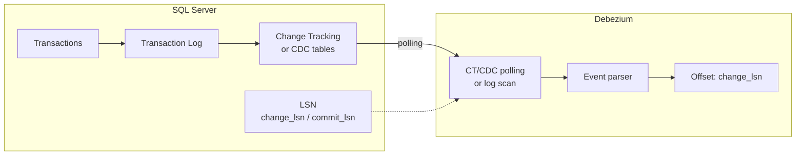

# SQL Server — CDC, change_lsn & commit_lsn

---

## How It Works



SQL Server CDC is enabled at the table level and exposes change rows through system functions. Debezium polls these change tables and publishes events to Kafka.

---

## Prerequisites

```sql
-- Enable CDC on database
EXEC sys.sp_cdc_enable_db;

-- Enable CDC on a specific table
EXEC sys.sp_cdc_enable_table
    @source_schema = N'dbo',
    @source_name   = N'orders',
    @role_name     = NULL,
    @supports_net_changes = 1;

-- Create Debezium user
CREATE LOGIN debezium WITH PASSWORD = 'SecurePassword123!';
CREATE USER debezium FOR LOGIN debezium;

-- Required permissions
EXEC sp_addrolemember N'db_datareader', N'debezium';
GRANT SELECT ON SCHEMA::cdc TO debezium;
GRANT SELECT ON SCHEMA::dbo TO debezium;
GRANT EXECUTE ON sys.fn_cdc_map_time_to_lsn TO debezium;
GRANT EXECUTE ON sys.fn_cdc_get_min_lsn TO debezium;
GRANT EXECUTE ON sys.fn_cdc_get_max_lsn TO debezium;
```

---

## Critical: change_lsn vs commit_lsn

> ❌ The generic `source.lsn` field **does not exist** in the SQL Server Debezium payload. Using it will silently return `null` — the most dangerous type of bug.

SQL Server exposes two LSN fields:

| Field | Identifies | Use for |
|---|---|---|
| `source.change_lsn` | The specific change within a transaction | **Deduplication** (preferred) |
| `source.commit_lsn` | The transaction commit point | Grouping events by transaction |

```python
elif source_type == 'sqlserver':
    # change_lsn: granularity per event — preferred for deduplication
    return df.withColumn('_offset_key', F.col('source.change_lsn'))

    # commit_lsn: use only when grouping by transaction matters
    # return df.withColumn('_offset_key', F.col('source.commit_lsn'))
```

---

## Connector Configuration

```json
{
  "name": "debezium-sqlserver-prod",
  "config": {
    "connector.class": "io.debezium.connector.sqlserver.SqlServerConnector",
    "database.hostname": "sqlserver-prod.empresa.com",
    "database.port": "1433",
    "database.user": "debezium",
    "database.password": "${file:/opt/connect/secrets.properties:ss.password}",
    "database.names": "mydb",
    "topic.prefix": "prod-ss",
    "table.include.list": "dbo.orders,dbo.customers",
    "snapshot.mode": "initial",
    "database.history.kafka.bootstrap.servers": "kafka:9092",
    "database.history.kafka.topic": "debezium.schema-history.prod-ss",
    "decimal.handling.mode": "precise",
    "heartbeat.interval.ms": "10000"
  }
}
```

---

## Monitoring

```sql
-- CDC jobs status
EXEC sys.sp_cdc_help_jobs;

-- CDC capture instances
SELECT capture_instance, source_schema, source_table, start_lsn, object_id
FROM cdc.change_tables;

-- Current LSN
SELECT sys.fn_cdc_get_max_lsn() AS max_lsn;

-- Unprocessed changes (lag indicator)
SELECT COUNT(*) AS pending_changes
FROM cdc.fn_cdc_get_all_changes_dbo_orders(
    sys.fn_cdc_get_min_lsn('dbo_orders'),
    sys.fn_cdc_get_max_lsn(),
    'all'
);
```
